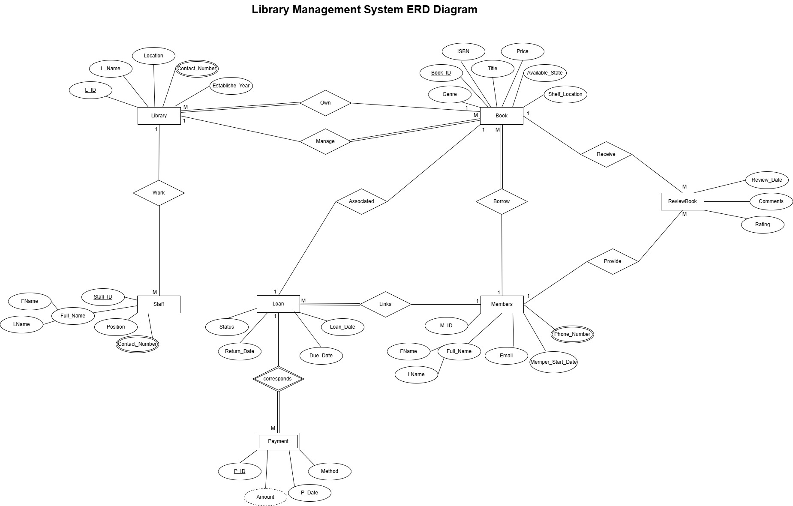
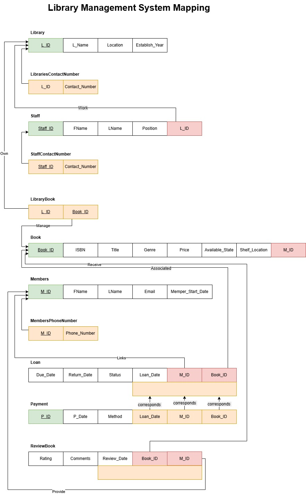

# LibraryManagementSystem_Project1 ( ERD , Mapping , Normalization)

## Description of database:

 
The Library Management System is designed to manage books, members, staff, 
loans, and transactions efficiently. The system includes libraries where each library 
has a unique ID, name, location, contact number, and established year. Each library 
must manage books, where each book is identified by a unique ID, ISBN, title, genre, 
price, availability status, and shelf location. A book belongs to exactly one library, 
and a library may own many books. 
Members can register with personal information such as ID, full name, email, phone 
number, and membership start date. A member can borrow zero or more books. 
Each loan links one member with one book and includes loan date, due date, return 
date, and status. 
Each loan may have zero or more fine payments, where a payment is uniquely 
identified and includes payment date, amount, and method. Payment always 
corresponds to one specific loan. 
Staff work at a specific library, identified by staff ID, full name, position, and contact 
number. Each library must have at least one staff member, but each member of staff 
works at only one library. 
Members may also review books, where a review includes a rating, comments, and 
review date. Each review is linked to a specific book and a specific member. A 
member can provide multiple reviews, and a book may receive many reviews.

### PDF file:
[Real Life Web Application Simulation DB Project1](.\PDF\RealLifeWebApplicationSimulationDB_Project1.pdf)

--------------
## ERD Diagram :

--------------
## Mapping of ERD to Relational Schema:

--------------

## Normalization:

### Library Table:
#### UNF :
#### Library Table
|L_ID  | L_Name                                | Location | ContactNumber      | EstablishedYear |
|------|---------------------------------------|----------|--------------------|-----------------|
| 1    | Children's Public Library             | Muscat   | 24557890 ,24559988 | 1990            |
| 2    | Sultan Qaboos cultural center library | Muscat   | 24557891           | 1995            |
| 3    | Public Knowledge Library              | Muscat   | 24557892, 24184752 | 2000            |

#### 1NF : ( Remove repeating groups )
##### Library Table
|L_ID  | L_Name                                | Location | EstablishedYear |
|------|---------------------------------------|----------|-----------------|
| 1    | Children's Public Library             | Muscat   | 1990            |
| 2    | Sultan Qaboos cultural center library | Muscat   | 1995            |
| 3    | Public Knowledge Library              | Muscat   | 2000            |

#### LibraryContactNumber Table
|L_ID   | ContactNumber      |
|-------|--------------------|
| 1     | 24557890           |
| 1     | 24559988           |
| 2     | 24557891           |
| 3     | 24557892           |
| 3     | 24184752           |

#### 2NF : ( Remove partial dependency ) Already satisfied ( L_ID is the primary key )
#### 3NF : ( Remove transitive dependency ) Already satisfied ( No transitive dependencies )
----------------------------
### Staff Table:
#### UNF :
|S_ID  | S_Name               | Position            | ContactNumber      | L_ID |
|------|----------------------|---------------------|--------------------|------|
| 1    | Salim Al Bulushi     | Librarian           | 92557890 ,99554874 | 1    |
| 2    | Fatima Al Shamsi     | Assistant Librarian | 92557891 ,99887766 | 1    |
| 3    | Ahmed Al Rashidi     | Librarian           | 92557892           | 2    |
| 4    | Aisha Al Busaidi     | Assistant Librarian | 92557893           | 2    |
| 5    | Khalid Al Balushi    | Librarian           | 92557894 ,99663322 | 3    |
| 6    | Layla Al Shamsi      | Assistant Librarian | 92557895 ,95115995 | 3    |

#### 1NF : ( Remove repeating groups )
##### Staff Table
|S_ID  | S_Name               | Position            | L_ID |
|------|----------------------|---------------------|------|
| 1    | Salim Al Bulushi     | Librarian           | 1    |
| 2    | Fatima Al Shamsi     | Assistant Librarian | 1    |
| 3    | Ahmed Al Rashidi     | Librarian           | 2    |
| 4    | Aisha Al Busaidi     | Assistant Librarian | 2    |
| 5    | Khalid Al Balushi    | Librarian           | 3    |
| 6    | Layla Al Shamsi      | Assistant Librarian | 3    |

#### StaffContactNumber Table
|S_ID   | ContactNumber      |
|-------|--------------------|
| 1     | 92557890           |
| 1     | 99554874           |
| 2     | 92557891           |
| 2     | 99887766           |
| 3     | 92557892           |
| 4     | 92557893           |
| 5     | 92557894           |
| 5     | 99663322           |
| 6     | 92557895           |
| 6     | 95115995           |

#### 2NF : ( Remove partial dependency ) Already satisfied ( S_ID is the primary key )
#### 3NF : ( Remove transitive dependency ) Already satisfied ( No transitive dependencies )

--------------------------

### Book Table:
#### UNF :

#### Book Table
|B_ID  | ISBN              | Title                                   | Genre       | Price | AvailabilityStatus | ShelfLocation | L_ID |
|------|-------------------|-----------------------------------------|-------------|-------|--------------------|---------------|------|
| 1    | 978-3-16-148410-0 | The Great Gatsby                        | Fiction     | 10.99 | Available          | A1            | 1    |
| 2    | 978-0-7432-7356-5 | A Brief History of Time                 | Non-Fiction | 15.99 | Available          | B2            | 1    |
| 3    | 978-0-06-112008-4 | To Kill a Mockingbird                   | Fiction     | 12.99 | Available          | C3            | 2    |
| 4    | 978-0-452-28423-4 | The Catcher in the Rye                  | Children    | 9.99  | Available          | D4            | 2    |
| 5    | 978-0-7432-7356-5 | The Art of War                          | Non-Fiction | 14.99 | Available          | E5            | 3    |
| 6    | 978-0-7432-7356-5 | The Alchemist                           | Fiction     | 11.99 | Available          | F6            | 3    |
| 7    | 978-0-7432-7356-5 | The Da Vinci Code                       | Reference   | 13.99 | Available          | G7            | 1    |
| 8    | 978-0-7432-7356-5 | The Power of Habit                      | Non-Fiction | 16.99 | Available          | H8            | 2    |
| 9    | 978-0-7432-7356-5 | The 7 Habits of Highly Effective People | Non-Fiction | 18.99 | Available          | I9            | 3    |
| 10   | 978-0-7432-7356-5 | The Fault in Our Stars                  | Fiction     | 10.99 | Available          | K11           | 2    |
| 11   | 978-0-7432-7356-5 | The Hunger Games                        | Reference   | 12.99 | Available          | L12           | 3    |
| 12   | 978-0-7432-7356-5 | The Book Thief                          | Children    | 11.99 | Available          | M13           | 1    |

#### 1NF : ( Remove repeating groups ) --> Already satisfied ( No repeating groups )
#### 2NF : ( Remove partial dependency ) Already satisfied ( B_ID is the primary key )
#### 3NF : ( Remove transitive dependency ) Already satisfied ( No transitive dependencies )
---------------------------
### LibraryBook Table
#### UNF :
#### LibraryBook Table
|L_ID   | B_ID  |
|-------|-------|
| 1     | 1     |
| 1     | 2     |
| 1     | 7     |
| 1     | 8     |
| 2     | 3     |
| 2     | 4     |
| 2     | 10    |
| 2     | 12    |
| 3     | 5     |
| 3     | 6     |
| 3     | 9     |
| 3     | 11    |
| 3     | 12    |

#### 2NF : ( Remove partial dependency ) Already satisfied ( L_ID and B_ID is the primary key )
#### 3NF : ( Remove transitive dependency ) Already satisfied ( No transitive dependencies )
--------------------------
### Member Table:
#### UNF :
#### Member Table
|M_ID  | F_Name               | L_Name               | Email                      | PhoneNumber          | MembershipStartDate |
|------|----------------------|----------------------|----------------------------|----------------------|---------------------|
| 1    | Ali                  | Alfarsi              | alialfarsi@gmail.com       | 92557890 ,99554874   | 2023-01-01          |
| 2    | Noor                 | Alhatmi              | nooralhatmi@gmail.com      | 92557891 ,99887766   | 2023-02-01          |
| 3    | Sara                 | Alwahabi             | saraalwahaibi@gmail.com    | 92557892 ,99663322   | 2023-03-01          |
| 4    | Ahmed                | Alnasri              | ahmedalnasri@gmail.com     | 92557893             | 2023-04-01          |
| 5    | Mohammed             | Alrashdi             | mohammedalrashdi@gmail.com | 92557894 ,99663322   | 2023-05-01          |
| 6    | Nasser               | Alsalmi              | nasseralsalmi@gmail.com    | 92557895 ,95115995   | 2023-06-01          |
| 7    | Layla                | Alqasmi              | laylaalqasmi @gmail.com    | 92557896             | 2023-07-01          |

#### 1NF : ( Remove repeating groups )
##### Member Table
|M_ID  | F_Name               | L_Name               | Email                      | MembershipStartDate |
|------|----------------------|----------------------|----------------------------|---------------------|
| 1    | Ali                  | Alfarsi              | alialfarsi@gmail.com       | 2023-01-01          |
| 2    | Noor                 | Alhatmi              | nooralhatmi@gmail.com      | 2023-02-01          |
| 3    | Sara                 | Alwahabi             | saraalwahaibi@gmail.com    | 2023-03-01          |
| 4    | Ahmed                | Alnasri              | ahmedalnasri@gmail.com     | 2023-04-01          |
| 5    | Mohammed             | Alrashdi             | mohammedalrashdi@gmail.com | 2023-05-01          |
| 6    | Nasser               | Alsalmi              | nasseralsalmi@gmail.com    | 2023-06-01          |
| 7    | Layla                | Alqasmi              | laylaalqasmi @gmail.com    | 2023-07-01          |
#### MemberPhoneNumber Table
|M_ID   | PhoneNumber          |
|-------|----------------------|
| 1     | 92557890             |
| 1     | 99554874             |
| 2     | 92557891             |
| 2     | 99887766             |
| 3     | 92557892             |
| 3     | 99663322             |
| 4     | 92557893             |
| 5     | 92557894             |
| 5     | 99663322             |
| 6     | 92557895             |
| 6     | 95115995             |
| 7     | 92557896             |
#### 2NF : ( Remove partial dependency ) Already satisfied ( M_ID is the primary key )
#### 3NF : ( Remove transitive dependency ) Already satisfied ( No transitive dependencies )

--------------------------

### Loan Table:
#### UNF :
#### Loan Table
 |L_ID  | M_ID  | B_ID  | LoanDate   | DueDate    | ReturnDate | Status     |
 |------|-------|-------|------------|------------|------------|------------|
 | 1    | 1     | 1     | 2023-01-10 | 2023-01-20 | 2023-01-15 | Returned   |
 | 2    | 2     | 2     | 2023-01-15 | 2023-01-25 | NULL       | Issued     |
 | 3    | 3     | 3     | 2023-02-01 | 2023-02-10 | 2023-02-20 | Overdue    |
 | 4    | 4     | 4     | 2023-02-05 | 2023-02-15 | NULL       | Issued     |
 | 5    | 5     | 5     | 2023-03-01 | 2023-03-10 | NULL       | Issued     |
 | 6    | 6     | 6     | 2023-03-05 | 2023-03-15 | NULL       | Issued     |

#### 1NF : ( Remove repeating groups ) Already satisfied ( No repeating groups )
#### 2NF : ( Remove partial dependency ) Already satisfied ( L_ID, M_ID and B_ID is the primary key )
#### 3NF : ( Remove transitive dependency ) Already satisfied ( No transitive dependencies )

--------------------------
### Payment Table:
#### UNF :
#### Payment Table
|P_ID  | LoanID | PaymentDate | Amount | PaymentMethod |M_ID  |B_ID  |
|------|--------|-------------|--------|----------------|------|------|
| 1    | 1      | 2023-01-15  | 5.00   | Cash           | 1    | 1    |
| 2    | 2      | 2023-01-20  | 10.00  | Credit Card    | 1    | 2    |
| 3    | 3      | 2023-02-10  | 15.00  | Debit Card     | 2    | 3    |
| 4    | 4      | 2023-02-15  | 20.00  | Cash           | 2    | 4    |
| 5    | 5      | 2023-03-05  | 25.00  | Credit Card    | 3    | 5    |
| 6    | 6      | 2023-03-15  | 30.00  | Debit Card     | 3    | 6    |

#### 1NF : ( Remove repeating groups ) Already satisfied ( No repeating groups )
#### 2NF : ( Remove partial dependency ) Already satisfied ( P_ID is the primary key )
#### 3NF : ( Remove transitive dependency ) Already satisfied ( No transitive dependencies )
--------------------------

### Review Table:
#### UNF :
#### Review Table
| M_ID  | B_ID  | Rating | Comments               | ReviewDate |	
|-------|-------|--------|------------------------|------------|
| 1     | 1     | 5      | Excellent book!        | 2023-01-15 |
| 1     | 2     | 4      | Very informative.      | 2023-01-20 |
| 2     | 3     | 3      | Good read.             | 2023-02-10 |
| 2     | 4     | 2      | Not my type.           | 2023-02-15 |
| 3     | 5     | 4      | Interesting concepts.  | 2023-03-05 |
| 3     | 6     | 5      | Loved it!              | 2023-03-15 |
| 4     | 7     | 3      | Average book.          | 2023-04-01 |
| 4     | 8     | 4      | Great for beginners.   | 2023-04-05 |

#### 1NF : ( Remove repeating groups ) Already satisfied ( No repeating groups )
#### 2NF : ( Remove partial dependency ) Already satisfied ( M_ID and B_ID is the primary key )
#### 3NF : ( Remove transitive dependency ) Already satisfied ( No transitive dependencies )

------------------------------------

